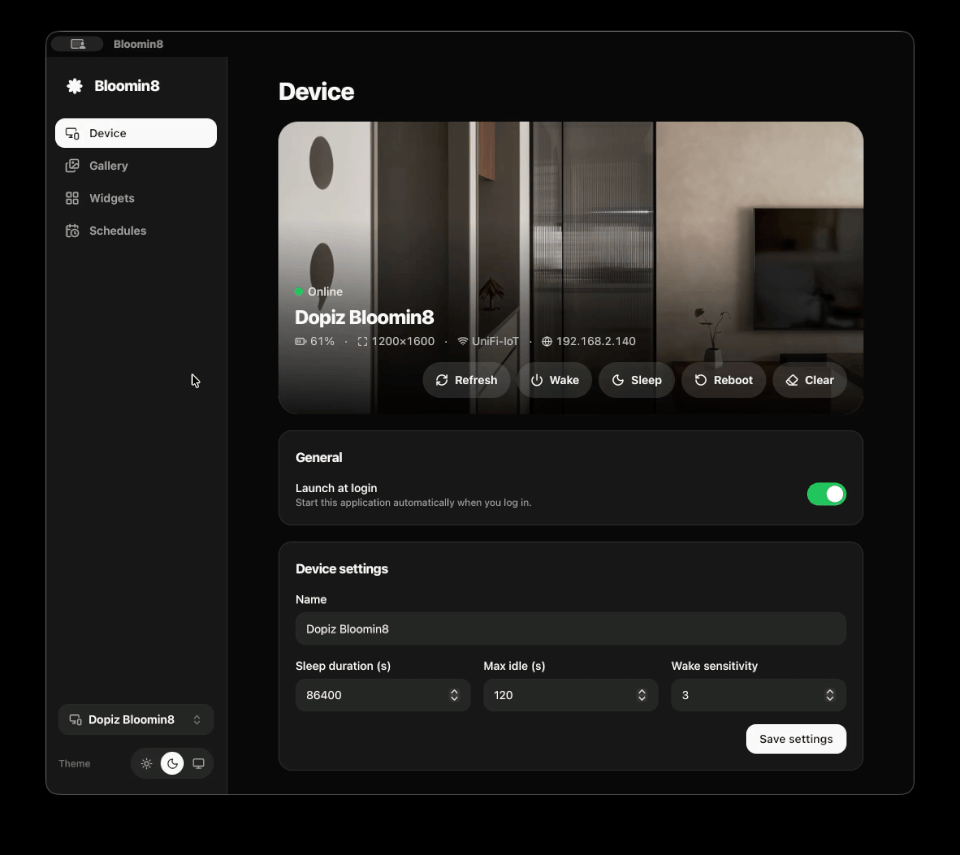

# Bloomin8 Desktop

[](https://dopiz.bobaboba.me)

A macOS desktop app that controls a **Bloomin8 colour e-ink Canvas**
directly over your LAN — **no cloud, no account, no sign-in**. Push photos and
widgets, manage the device's gallery and playlists, and schedule recurring
refreshes, all from a native app that lives in your tray.

Built with **Tauri v2 (Rust) + React 19 + TypeScript + Tailwind v4**, and
crafted with Claude Code.

<p align="center">
  
</p>

## Features

- **Multiple devices** — add Canvases by LAN IP and switch between them from the
  sidebar. Every device keeps its own settings, gallery, and schedules; the
  active device's real name and Wi-Fi/IP are shown in the header.
- **Local library → framed push** — keep your own image originals on your
  machine, then push any of them with per-push display settings (orientation,
  fit / fill / auto, black or white border). Images are processed **client-side**
  to the exact panel size, with a live picture-frame preview.
- **On-device view** — browse the images actually stored on the Canvas.
- **Widgets** — crypto prices, weather (with one-tap "use my location"), and a
  countdown. Preview, then push, in portrait or landscape.
- **Per-device schedules** — cron-based recurring pushes of a widget *or* a
  fixed image from your library; enable/disable each schedule and review run
  history.
- **Device control** — rename, sleep timers, BLE wake, reboot, clear screen,
  and launch-at-login.
- **Light / dark theme.**

> **Scheduling is local.** The Canvas firmware has no scheduling API — the
> official phone app does it via its cloud. This app schedules entirely on your
> machine, so recurring pushes only fire while it is running (it stays in the
> tray after you close the window).

> **Playlists are disabled in this first release.** The device-native playlist
> flow (build a rotation from images already on the device) still needs work, so
> its UI is turned off for now — the code is kept behind a flag
> (`PLAYLISTS_ENABLED` in `src/components/OnDeviceDialog.tsx`) and will return in
> a later version.

## Open API reference

This app talks to the Canvas over its **LAN HTTP protocol** — the same
real-time, action-oriented endpoints the device exposes for `show` / `upload`
/ settings / gallery / playlist operations. There is **no scheduling endpoint
on the device**; all recurring pushes are driven locally by this app (see the
scheduling note above).

The device protocol is documented in BLOOMIN8's official Home Assistant
integration:

- Official OpenAPI spec: <https://github.com/ARPOBOT-BLOOMIN8/eink_canvas_home_assistant_component/blob/main/openapi.yaml>
- Home Assistant component repo: <https://github.com/ARPOBOT-BLOOMIN8/eink_canvas_home_assistant_component>

## Development

```sh
pnpm install
pnpm tauri dev          # run the app in dev mode
pnpm build              # frontend typecheck + build (tsc && vite build)
cargo test --manifest-path src-tauri/Cargo.toml   # Rust unit tests (MockDevice, no hardware)
```

## Disclaimer

This is an **unofficial, third-party community tool**. It is **not affiliated
with, endorsed by, or supported by** ARPOBOT or BLOOMIN8. "Bloomin8" and any
related names, logos, or trademarks belong to their respective owners and are
used here **only for compatibility and identification purposes**.

The software is provided **"AS IS", without warranty of any kind**, express or
implied. **Use it at your own risk** — the author accepts no responsibility for
any impact on your device, data, or network.

It communicates directly with the Canvas over your local network using a
**device protocol that is not guaranteed to be stable or publicly supported**;
a firmware update may change or break it at any time.
